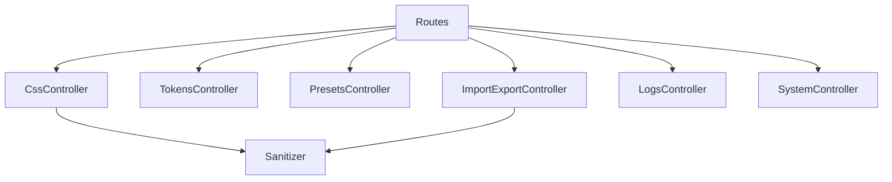

# Organisation des endpoints REST

Ce plugin expose ses endpoints via une série de contrôleurs spécialisés situés dans `src/Infra/Rest`. Chaque contrôleur est responsable d'un domaine fonctionnel précis :

- `CssController` : sauvegarde du CSS actif, gestion des révisions et réinitialisation des options.
- `TokensController` : lecture et écriture des Design Tokens.
- `PresetsController` : gestion des presets et des presets Avatar Glow.
- `ImportExportController` : flux d'import/export de configuration et d'assets CSS.
- `LogsController` : nettoyage du journal interne.
- `SystemController` : route de diagnostic/health-check qui vérifie l'état des assets, les versions et l'intégrité des composants critiques (autoload des classes principales, fonctions de cache CSS, statut du registre de tokens).

Les contrôleurs implémentent l'interface `ControllerInterface` et héritent de `BaseController`, qui centralise la logique d'autorisation REST (nonce, authentification alternative et contrôle de capacité).

L'enregistrement des routes s'effectue via `SSC\Infra\Routes`. À l'initialisation (`Routes::register()`), un service de sanitisation (`SSC\Infra\Import\Sanitizer`) est instancié puis partagé entre les contrôleurs qui en ont besoin (`CssController` et `ImportExportController`). Chaque contrôleur expose ensuite ses routes au moment du hook `rest_api_init`.

## Sanitizer d'import

Le service `SSC\Infra\Import\Sanitizer` contient l'ensemble des helpers de nettoyage utilisés lors des imports (normalisation des tableaux JSON, vérification des doublons, combinaison des variantes responsives, etc.). Les méthodes `sanitizeImport*` sont réutilisées par les contrôleurs qui acceptent des payloads JSON et garantissent une validation homogène des données entrantes.

## Diagramme de dépendances simplifié

Ce découpage facilite l'ajout de nouveaux endpoints (création d'un contrôleur dédié) et permet le partage explicite des composants transverses comme le sanitiseur d'import.
