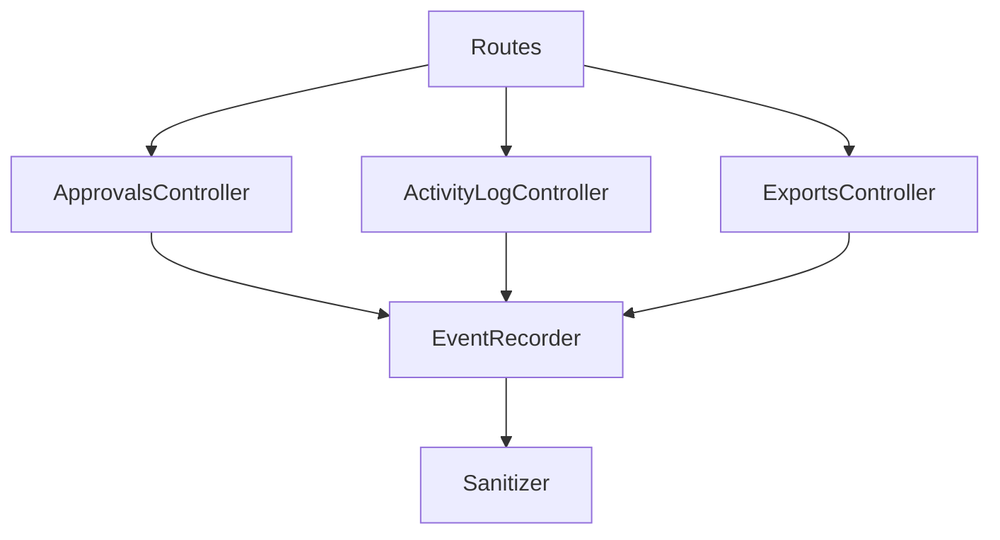
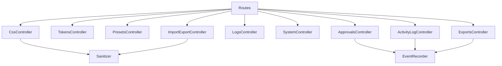

# Organisation des endpoints REST

Ce plugin expose ses endpoints via une série de contrôleurs spécialisés situés dans `src/Infra/Rest`. Chaque contrôleur est responsable d'un domaine fonctionnel précis :

- `CssController` : sauvegarde du CSS actif, gestion des révisions et réinitialisation des options.
- `TokensController` : lecture et écriture des Design Tokens.
- `PresetsController` : gestion des presets et des presets Avatar Glow.
- `ImportExportController` : flux d'import/export de configuration et d'assets CSS.
- `LogsController` : nettoyage du journal interne.
- `SystemController` : route de diagnostic/health-check qui vérifie l'état des assets, les versions et l'intégrité des composants critiques (autoload des classes principales, fonctions de cache CSS, statut du registre de tokens).

Les contrôleurs implémentent l'interface `ControllerInterface` et héritent de `BaseController`, qui centralise la logique d'autorisation REST (nonce, authentification alternative et contrôle de capacité).

L'enregistrement des routes s'effectue via `SSC\Infra\Routes`. À l'initialisation (`Routes::register()`), un service de sanitisation (`SSC\Infra\Import\Sanitizer`) est instancié puis partagé entre les contrôleurs qui en ont besoin (`CssController` et `ImportExportController`). Chaque contrôleur expose ensuite ses routes au moment du hook `rest_api_init`.

## Nouveaux contrôleurs livrés

Les workflows de gouvernance décrits dans la note [_Gouvernance des tokens et workflow d’approbation_](./TOKEN-GOVERNANCE-AND-DEBUG.md) sont désormais exposés via trois contrôleurs dédiés :

- `ApprovalsController` : reçoit les demandes d’approbation de tokens, applique la capacité `manage_ssc_approvals`, enregistre les commentaires et déclenche la transition `draft → ready` ou le retour en brouillon.
- `ActivityLogController` : interroge la table `wp_ssc_activity_log`, fournit pagination, filtres temporels (`24h`, `7d`, `30d`) et export CSV/JSON pour audit.
- `ExportsController` : génère les exports multi-plateformes (JSON brut, Style Dictionary, Android XML, iOS JSON) pour les scopes `ready`, `deprecated` ou `all`, soumis à la capability `manage_ssc_exports`.

Ces services s’appuient sur la couche `EventRecorder`, qui crée la table `wp_ssc_activity_log`, attribue les capacités par défaut aux administrateurs et consigne chaque événement métier (création/mise à jour de token, export généré, décision d’approbation).

Le schéma suivant synthétise les interactions mises en place :

> ✅ **Statut** : backend livré (déc. 2024) et formulaire Tokens connecté (janv. 2025).

La page **Supersede CSS → Tokens** consomme désormais `GET/POST /ssc/v1/approvals` pour afficher le statut courant des variables (badge `Brouillon`, `Prêt`, `Déprécié`) et proposer un bouton « Demander une revue » qui déclenche la route `POST /ssc/v1/approvals`. Un indicateur « Revue en attente » est rendu côté UI tant que la décision n’est pas prise, et un message d’état remplace le bouton si l’utilisateur ne possède pas la capability `manage_ssc_approvals`.

## Sanitizer d'import

Le service `SSC\Infra\Import\Sanitizer` contient l'ensemble des helpers de nettoyage utilisés lors des imports (normalisation des tableaux JSON, vérification des doublons, combinaison des variantes responsives, etc.). Les méthodes `sanitizeImport*` sont réutilisées par les contrôleurs qui acceptent des payloads JSON et garantissent une validation homogène des données entrantes.

## Diagramme de dépendances simplifié

Ce découpage facilite l'ajout de nouveaux endpoints (création d'un contrôleur dédié) et permet le partage explicite des composants transverses comme le sanitiseur d'import.
